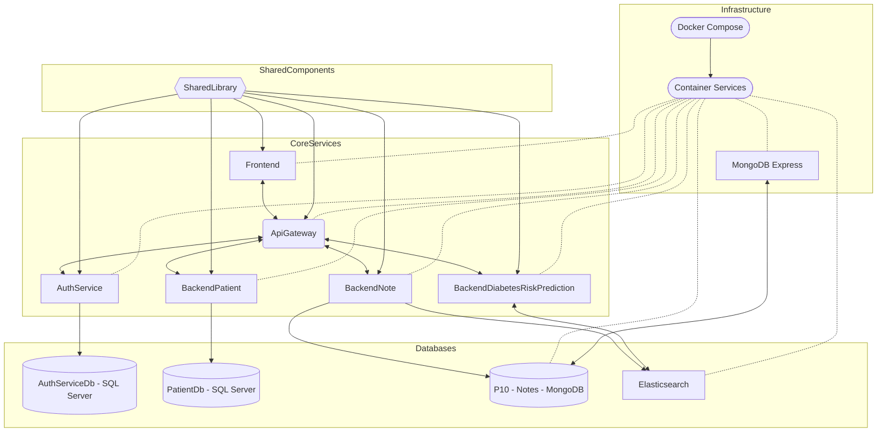

# P10 Projet Éducatif

Le but de l'application que vous développez est de permettre la détection du diabète de type 2 chez les patients. En utilisant une architecture microservices, cette application permettra de gérer les dossiers patients, les notes des médecins, et d'anticiper le niveau de risque de diabète d'un patient. L'objectif final est donc de fournir une solution complète pour le dépistage des risques de diabète, en respectant les normes de qualité de données, en assurant la sécurité de l'accès aux données des patients et en suivant les principes du Green Code pour la protection de l'environnement.

## Description

Ce projet est une application web composée de plusieurs microservices backend et frontend. Il utilise **ASP.NET Core 8** pour les services backend et un frontend basé sur **ASP.NET MVC**.


## Sommaire

- [P10 Projet Éducatif](#p10-projet-éducatif)
  - [Description](#description)
  - [Sommaire](#sommaire)
  - [Structure du Projet](#structure-du-projet)
  - [Démarrage Rapide](#démarrage-rapide)
  - [Installation](#installation)
  - [Prérequis](#prérequis)
  - [Clonage du Repository et Installation](#clonage-du-repository-et-installation)
  - [Installation de SQL Server Express](#installation-de-sql-server-express)
  - [Restauration des Bases de Données](#restauration-des-bases-de-données)
    - [Recommandé : Restauration des Bases de Données à partir des Sauvegardes](#recommandé--restauration-des-bases-de-données-à-partir-des-sauvegardes)
      - [Étapes de Restauration des données des Bases de Données :](#étapes-de-restauration-des-données-des-bases-de-données-)
    - [Mapper le login 'backend\_user' aux bases de données restaurées :](#mapper-le-login-backend_user-aux-bases-de-données-restaurées-)
    - [Non recommandé : Restauration des Bases de Données en utilisant les Migrations Entity Framework (SQL Server)](#non-recommandé--restauration-des-bases-de-données-en-utilisant-les-migrations-entity-framework-sql-server)
      - [BackendPatient](#backendpatient)
      - [Auth](#auth)
  - [Docker](#docker)
  - [Configuration](#configuration)
    - [Variables d'environnement](#variables-denvironnement)
    - [Configuration des services](#configuration-des-services)
  - [Sécurité](#sécurité)
    - [Authentification](#authentification)
    - [Autorisation](#autorisation)
    - [Comptes Utilisateurs par Défaut](#comptes-utilisateurs-par-défaut)

## Structure du Projet




- **ApiGateway** : Contient le projet de la passerelle API Gateway implémenté avec **Ocelot**.
- **Auth** : Contient le projet d'authentification avec **Identity** + **Entity Framework** et **SQL Server** en utilisant **JWT Bearer**.
- **BackendNote** : Contient le projet de gestion des notes **MongoDB Driver** et **MongoDB** et **Elasticsearch**.
- **BackendPatient** : Contient le projet de gestion des patients avec **Entity Framework** et **SQL Server**.
- **BackendDiabetesRiskPrediction** : Contient le projet de prédiction du risque de diabète avec **Elasticsearch**.
- **Frontend** : Contient le projet frontend avec **ASP.NET Core 8 MVC**.
- **SharedLibrary** : Contient les bibliothèques partagées entre les différents projets.

Frontend (port 7000) effectue des requêtes auprès de l'API Gateway (port 5000). API Gateway redirige les requêtes vers :

- BackendPatient (port 7200),
- Auth Service (port 7201),
- BackendNote (port 7202),
- BackendDiabetesRiskPrediction (port 7204).

BackendPatient utilise SQL Server via Entity Framework pour la gestion des patients. Auth Service gère l'authentification de tous les microservices avec JWT Bearer (tokens + refresh). BackendNote utilise MongoDB pour la gestion des notes. BackendDiabetesRiskPrediction utilise Elasticsearch pour la prédiction du risque de diabète.

## Démarrage Rapide

1. Clonez le repository :

    ```bash
    git clone https://github.com/EveCrystali/P10.git
    cd P10  
    ```

2. Assurez-vous d'avoir installé :
   - Docker Desktop
   - SQL Server Express
   - .NET 8 SDK

3. Restaurez les bases de données SQL Server pour les services BackendPatient et Auth :
   - Utilisez les fichiers de sauvegarde dans `P10>SQLServerDBBackup` et créer l'utilisateur `backend_user` dans SMSS pour les services BackendPatient et Auth (voir [Recommandé : Restauration des Bases de Données à partir des Sauvegardes](#recommandé--restauration-des-bases-de-données-à-partir-des-sauvegardes) et [Mapper le login 'backend_user' aux bases de données restaurées :](#mapper-le-login-backend_user-aux-bases-de-données-restaurées-))

4. Lancez les services avec Docker :

   ```bash
   docker-compose build --no-cache
   docker-compose up -d
   ```

5. Accédez à l'application :
   - Frontend : http://localhost:7000

Pour plus de détails sur l'installation et la configuration, consultez les sections suivantes.

## Installation

Le projet utilise **Docker** pour la gestion des services backend, frontend, l'API Gateway et les bases de données MongoDB et Elasticsearch.

## Prérequis

- [.NET 8 SDK](https://dotnet.microsoft.com/download/dotnet/8.0)
- [Docker Desktop](https://www.docker.com/products/docker-desktop)
- [SQL Server Express](https://www.microsoft.com/fr-fr/sql-server/sql-server-downloads)

## Clonage du Repository et Installation

1. Clonez le repository :

    ```bash
    git clone https://github.com/EveCrystali/P10.git
    cd P10
    ```

2. Assurez-vous d'avoir dotnet 8 installé sur votre machine.

3. Assurez vous d'avoir installé l'outil Entity Framework Core :

    `dotnet tool install --global dotnet-ef`

4. Restaurez les packages NuGet pour tous les services :

    Depuis la racine du projet :
    `dotnet restore`

## Installation de SQL Server Express

1. **Téléchargement et Installation :**
   - Téléchargez **SQL Server Express** depuis [ce lien](https://www.microsoft.com/fr-fr/sql-server/sql-server-downloads).
   - Lancez l’installateur et suivez les instructions à l'écran.
   - **Configuration de l’instance :**
     - Choisissez une installation par défaut ou nommée selon vos préférences.
     - Configurez le mode d’authentification en sélectionnant **Authentification mixte** (Windows + SQL Server).
     - Définissez un mot de passe fort pour l’utilisateur `sa`.

2. **Activation de TCP/IP :**
   - Ouvrez **SQL Server Configuration Manager**.
   - Naviguez vers **SQL Server Network Configuration > Protocols for [Votre Instance]**.
   - Activez **TCP/IP**.
   - Redémarrez le service **SQL Server** pour appliquer les changements.

## Restauration des Bases de Données

Les bases de données SQL Server pour les microservices `BackendPatient` et `Auth` ne sont pas contenerisées dans Docker. Vous pouvez les restaurer depuis les fichiers de sauvegarde fournis dans `P10>SQLServerDBBackup` (recommandé) ou décider de créer manuellement des bases de données SQL Server via SQL Server Express puis utiliser des migrations to code first avec Entity Framework (non recommandé). Une seule de ces deux méthodes est à réaliser. Pour plus de détails sur la restauration des bases de données SQL Server, voir la section **Restauration des Bases de Données à partir des Sauvegardes**. Pour plus de détails sur la création manuelle des bases de données SQL Server avec migrations to code first, voir la section **Restauration des Bases de Données en utilisant les Migrations Entity Framework (SQL Server)**.

### Recommandé : Restauration des Bases de Données à partir des Sauvegardes

Pour simplifier la configuration des bases de données, vous pouvez restaurer les bases de données à partir des fichiers de sauvegarde fournis dans P10>SQLServerDBBackup.

#### Étapes de Restauration des données des Bases de Données :

1. **Ouvrir SQL Server Management Studio (SSMS) :**

   - Lancez **SSMS** et connectez-vous à votre instance SQL Server.

2. **Créer le login 'backend_user' avec accès pour les containers :**

    - Dans l’Explorateur d’objets, faites un clic droit sur `Sécurité > Nouveau`, puis sélectionnez `Connexion`
    - Sélectionnez ``Authentification SQL Server``.
    - Nom de connexion : ``backend_user``
    - Mot de passe : ``Str0ng!Passw0rd#2024-renew``
    - Décochez Exiger que le mot de passe soit modifié lors de la première connexion.
    - Dans l'onglet ``État``, assurez-vous que ``Autorisation de se connecter au moteur de base de données`` est sur ``Accorder`` et que ``Connexion`` est ``Activé``.
    - Cliquez sur OK pour créer le login.

3. **Restaurer `AuthServiceDb` :**

   - Faites un clic droit sur `Base de données` dans l’Explorateur d’objets et sélectionnez ``Restaurer la base de données``
   - Sélectionnez ``Support`` et naviguez jusqu’au fichier de sauvegarde `AuthServiceDb.bak`.
   - Configurez les options si nécessaire et cliquez sur ``OK`` pour lancer la restauration.

4. **Restaurer `PatientDb` :**

   - Répétez le même processus que pour `AuthServiceDb`, en sélectionnant le fichier `PatientDb.bak`.
  
5. **Vérifier la Restauration :**

    - Assurez-vous que les bases de données AuthServiceDb et PatientDb apparaissent dans l’Explorateur d’objets et que les tables et données sont correctes.

### Mapper le login 'backend_user' aux bases de données restaurées :

   1. Pour ``AuthServiceDb`` :

        - Développez ``Bases de données > AuthServiceDB > Sécurité > Utilisateurs``.
        - Faites un clic droit sur ``Utilisateurs`` et sélectionnez ``Nouvel utilisateur``...
        - Nom de l'utilisateur : ``backend_user``
        - Connexion : cliquez sur ``...`` puis ``Parcourir`` et sélectionnez ``backend_user`` dans la liste déroulante et validez en cliquant sur OK.
        - Dans l'onglet ``Schémas appartenant à un rôle``, cochez **``db_owner``**.
        - Cliquez sur OK pour créer l'utilisateur.

   2. Pour ``PatientDb`` :

        - Répétez les mêmes étapes que ci-dessus pour la base de données PatientDb.

   3. **Vérifier la Restauration :**

      - Assurez-vous que les bases de données `AuthServiceDb` et `PatientDb` apparaissent dans l’Explorateur d’objets et que les schémas et données sont corrects.

   4. **Vérifier les permissions :**

       - Assurez-vous que l'utilisateur ``backend_user`` a bien les permissions appropriées sur les deux bases de données.
       Vous pouvez tester la connexion en utilisant l'utilisateur ``backend_user`` pour vous connecter à chaque base de données.

   5. **Configurer les Chaînes de Connexion :**

       - Les chaînes de connexion pour AuthServiceDb et PatientDb sont définies dans le fichier docker-compose.yml pour les services auth et backendpatient.
       - Elles utilisent le serveur host.docker.internal,1433 pour permettre aux containers Docker d'accéder à l'instance SQL Server sur l'hôte.

   6. **Configuration des Variables d’environnement :**

      - Le fichier .env contient les variables suivantes, qui correspondent à l'utilisateur créé :

       ```env
       DB_USER=backend_user
       DB_PASSWORD=Str0ng!Passw0rd#2024-renew
       ```

### Non recommandé : Restauration des Bases de Données en utilisant les Migrations Entity Framework (SQL Server)

*Si vous choisissez cette méthode, assurez-vous de modifier les variables d'environnement DB_USER et DB_PASSWORD pour correspondre aux identifiants que vous utiliserez. Notez que cette méthode est plus complexe et sujette à erreurs.*

Si vous décidez de restaurer les bases de données SQL Server en utilisant des migrations to code first avec Entity Framework, n'oubliez pas de modifier les variables d'environnement `DB_USER` et `DB_PASSWORD` dans le fichier `.env` pour correspondre aux valeurs utilisées lors de la restauration. De même il vous faudra modifier le fichier `docker-compose.yml` pour modifier la configuration des chaînes de connexions `SQL_SERVER_CONNECTION_STRING` pour correspondre aux valeurs utilisées lors de la création des bases de données.


#### BackendPatient

1. Création de la base de données :

   Depuis SQL Server Management Studio (SSMS) :
   - Ouvrir **SSMS** et connectez-vous à votre instance SQL Server.
   - Faites un clic droit sur **Databases** dans l’Explorateur d’objets et sélectionnez **Create Database...**
   - Entrez le nom de la base de données souhaite (par exemple, "PatientDb") et cliquez sur **OK**.
   - Dans l'onglet **Autorisations**, sélectionnez votre nouvel utilisateur et attribuez les permissions nécessaires.
   - Dans la page **Rôles du serveur**, cochez **dbcreator** et cliquez sur **OK**.
   - Faites un clic droit sur **Databases** dans l’Explorateur d’objets et sélectionnez **Create Database...**
   - Entrez le nom de la base de données souhaite (par exemple, "PatientDb") et cliquez sur **OK**.


2. OPTIONNEL : Création d'une nouvelle migration :

    Le repository contient déjà les fichiers initiaux pour créer une migration initial.

    ```bash
    cd BackendPatient
    dotnet ef migrations add Migration0
    ```

3. Mise à jour de la base de données :

    ```bash
    cd BackendPatient
    dotnet ef database update
    ```

#### Auth

1. Création de la base de données :

   Depuis SQL Server Management Studio (SSMS) :
   - Ouvrir **SSMS** et connectez-vous à votre instance SQL Server.
   - Faites un clic droit sur **Databases** dans l’Explorateur d’objets et sélectionnez **Create Database...**
   - Entrez le nom de la base de données souhaite (par exemple, "AuthServiceDb") et cliquez sur **OK**.

2. OPTIONNEL :Création d'une nouvelle migration :
   
    Le repository contient déjà les fichiers initiaux pour créer une migration initial.

    ```bash
    cd Auth
    dotnet ef migrations add Migration0
    ```

3. Mise à jour de la base de données :

    ```bash
    cd Auth
    dotnet ef database update
    ```

## Docker

1. Construction des images :

    `docker-compose build --no-cache`

2. Démarrage des services :

    `docker-compose up -d`

3. Arrêt des services :
    
    `docker-compose down`

Les services suivants seront disponibles :

- Frontend : http://localhost:7000
- ApiGateway : http://localhost:5000
- Auth : http://localhost:7201
- BackendPatient : http://localhost:7200
- BackendNote : http://localhost:7202
- BackendDiabetesRiskPrediction : http://localhost:7204
- MongoDB : http://localhost:27017
- SQL Server : localhost,1433
- Elasticsearch : http://localhost:9200
- MongoDB Express : http://localhost:8081 

Un service MongoDB Express est disponible sur le port 8081 afin de pouvoir visualiser les collections MongoDB.

## Configuration

### Variables d'environnement

Chaque service nécessite des variables d'environnement spécifiques. Un fichier `.env` est fourni dans le projet. Assurez-vous de mettre à jour ces variables selon votre environnement si besoin.

### Configuration des services

Chaque service possède son propre fichier `appsettings.json` pour la configuration spécifique. Si besoin, mettez à jour ces fichiers selon votre environnement.

## Sécurité

### Authentification

L'application utilise JWT (JSON Web Tokens) pour l'authentification :

1. Les tokens sont émis par le service Auth
2. Tous les services vérifient la validité des tokens
3. Les tokens ont une durée de validité de 15 minutes. 
4. La durée de validité des refresh tokens est de 7 jours.

### Autorisation

Les rôles suivants sont disponibles : `Admin`, `Practitioner`, `User`.
Seuls les rôles `Admin` et `Practitioner` peuvent accéder aux services backend.

### Comptes Utilisateurs par Défaut

Pour faciliter les tests, les comptes suivants sont disponibles :

- **Admin :**
  - **Nom d'utilisateur :** admin@email.com
  - **Mot de passe :** 0vBZBB.QH83GeE.
  - **Rôle :** Admin

- **Practitioner :**
  - **Nom d'utilisateur :** practitioner@email.com
  - **Mot de passe :** 1vBZBB.QH83GeE.
  - **Rôle :** Practitioner

- **User :**
    - **Nom d'utilisateur :** noroleuser@email.com
    - **Mot de passe :** 2vBZBB.QH83GeE.
    - **Rôle :** User

Vous pouvez utiliser ces comptes pour vous connecter à l'application et tester les différentes fonctionnalités en fonction des rôles.
